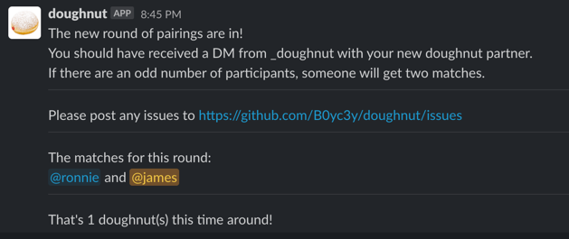
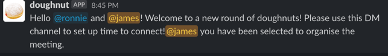

# doughnut_bot
Bare bones, custom version of [Donut Slack App](https://slack.com/apps/A11MJ51SR-donut?tab=more_info)

This app gets all active, non-bot users in a Slack channel and randomly pairs them up for a social catch up, taking into account previous matches and timezones.
The app will create a DM with the matched users, and post the matches to the channel it's pulling from.

*Channel message when a new round of matches are in:*


*DM to organise a catch up:*


It uses the most recent match in the history file to get last run date, and if 7 days or more it will prompt the matches to catch up, if 14 days or more has passed it will make new matches with everyone included in the target channel.

### Installation
Assuming you have [virtualenv](https://github.com/pypa/virtualenv) and [pip](https://github.com/pypa/pip) installed the below will setup the requirements.
```shell
virtualenv venv
source venv/bin/activate
pip3 install -r requirements.txt
```

### Environment Setup
Some of these env vars are defaulted, the token and bucket names are the only required env vars.
Post matches is required to be true to execute fully.
```shell
# Your slack API token with the scopes mentioned below
export SLACK_API_TOKEN="SlackTokenHere" # get a slack integration token from your slack admin
# Where do we pull history from/write history to?
export DOUGHNUT_S3_BUCKET="doughnut-store" 
# The slack channel(s) to run against 
export SLACK_CHANNELS="channelName:channelId,channelName2:channelId2" 

# Optional env vars overrides
# enable POST_MATCHES to actually post results to slack, and to write history to s3
export POST_MATCHES=True
# Number of days between matching runs, prompting occurs half way through
export DAYS_BETWEEN_RUNS=14 
# Where locally do we store history whilst running?
export HISTORY_PATH="./doughnut_history" 
```

### Slack App Setup

Follow this (USE THE SCOPES DEFINED BELOW) [slack tutorial](https://github.com/slackapi/python-slack-sdk/blob/main/tutorial/01-creating-the-slack-app.md) to setup a new slack app
Make sure you note down the name of your bot, and your OAuth token, they will need to be set as env vars below.
Once you have your bot create a new slack channel (note the name down for below)
type `/invite @<MyBotName>`  into the channel you wish to add the bot to

```
# Required Permissions for doughnut
chat:write
groups:read
mpim:write
users.profile:read
users:read
```

## Build new image
```
docker build -t doughnut:latest .
```

### Run me
```shell
python3 doughnut.py

# docker run the latest version from dockerhub
docker run \
    -e "SLACK_API_TOKEN=$SLACK_API_TOKEN" \
    -e "DOUGHNUT_S3_BUCKET=doughnut-store" \
    -e "SLACK_CHANNELS=channelName:channelId" 
    boycey/doughnut:latest

# docker run self built image
docker run \
    -e "SLACK_API_TOKEN=$SLACK_API_TOKEN" \
    -e "DOUGHNUT_S3_BUCKET=doughnut-store" \
    -e "SLACK_CHANNELS=channelName:channelId"
    doughnut:latest
```

## Improvements to come
 - Opt out of matching with certain individuals
 - Convert from scripts to class based implementation
 - Make chat implementation more generic to allow for other chat integrations (EG: Discord)
 - Use better data structure when storing history
 - Add some better testing for the matcher